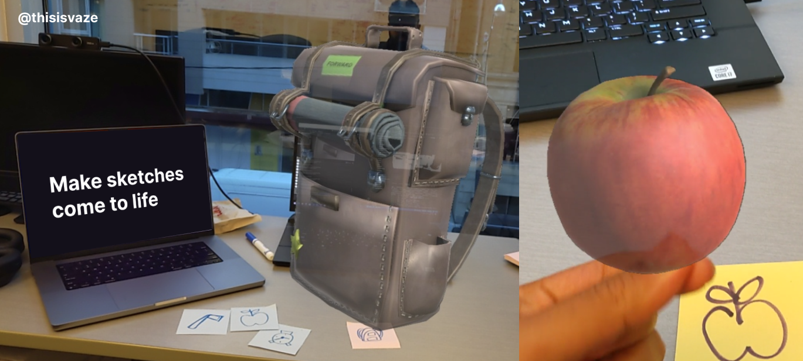

# shaka-laka-boom-boom


### Prerequisities: Hololens 2 (with Holographic Remoting enabled and setup)

#### Models are being added to support 345 categories of QuickDraw Sketch dataset but currently supports around 30
#### This repository is not actively mantained and might have bugs or issues. It is more of an inspiration on acquiring context with Hololens 2.
# Instructions

## Building server utilities

### 1. Setup python backend
```pip install -r requirements.txt```

### 2. Start python server
```python -m uvicorn main:app```

## Unity project

### 3. Start Hololens 2 Holographic remoting

